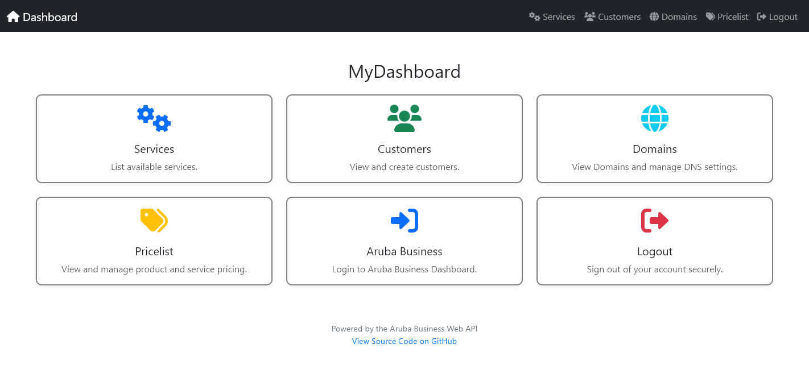
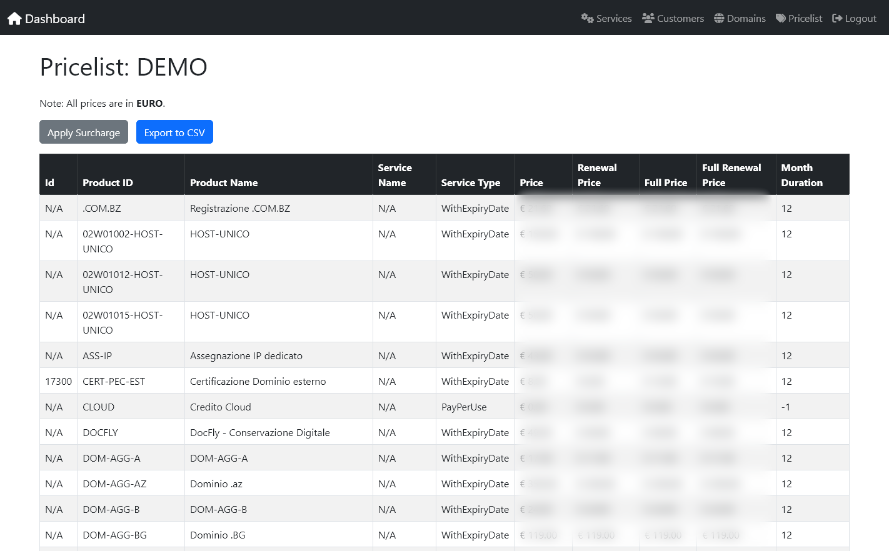

# MyDashboard

This is a custom dashboard designed to view services, customers, domains, and product pricings for Aruba Business. It provides an intuitive and minimal interface.

## Features
- **Dashboard Overview**: A central hub to access all key functionalities.
- **Services Management**: View available services.
- **Customer Management**: View and export customer information. Add new customers.
- **Domain Management**: View domain registrations and DNS records.
- **Pricing Management**: View and manage product and service pricing.

---

## Screenshots

---

## Aruba Business API

This dashboard relies on the **Aruba Business Web API** to fetch and manage data. The API provides endpoints for interacting with services, customers, domains, and pricing. Below are some key details about the API:

- **Authentication**: The API uses token-based authentication. The `configure.php` file contains the necessary credentials to acquire tokens.

- **Link**: https://api.arubabusiness.it/docs/

---

## Security Notice

⚠️ **Important**: This dashboard is intended for **internal use only**. It should not be exposed to the public web. Ensure the following security measures are in place:
- Restrict access to the dashboard using a VPN or internal network.
- Use strong authentication mechanisms to prevent unauthorized access.
- Regularly update dependencies and monitor for vulnerabilities.
- Do not expose sensitive configuration files (e.g., `configure.php`) to the public.
